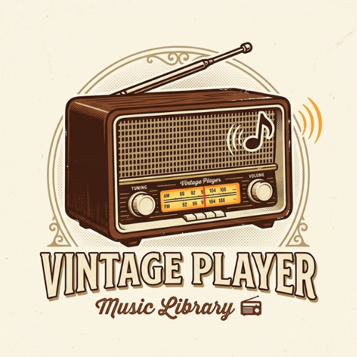

<div align="center">
  
  <h1>Vintage Player 📻</h1>
  <p><strong>Tu Fonoteca Personal de Estilo Retro | P2P Local Audio Streaming</strong></p>
</div>

[](https://vuejs.org/)
[](https://tailwindcss.com/)
[](https://firebase.google.com/)
[](https://webrtc.org/)

---

## 🌟 ¿Qué es Vintage Player?

**Vintage Player** no es solo un reproductor de música; es una **alternativa de código abierto (Open Source) verdaderamente libre a servicios comerciales como Spotify**. 

En lugar de depender de servidores costosos, almacenamiento en la nube infinito o algoritmos de recomendación cerrados, Vintage Player aprovecha la potencia de tus propios dispositivos. Utilizando **WebRTC**, la aplicación permite que tu teléfono celular funcione como el servidor de tu música (transmitiendo los archivos locales que tienes guardados), y tu PC u otros dispositivos actúen como receptores y reproductores de alta fidelidad, todo bajo una interfaz exquisita con temática vintage, sombras pronunciadas y micro-interacciones suaves.

### 💡 ¿Por qué es una solución viable frente a Spotify?
1. **100% Gratuito y Privado:** No hay suscripciones. Tu música es tuya, la compartes de tu móvil a tu PC en tu red local. Nadie rastrea lo que escuchas.
2. **Cero Latencia en Red Local:** Al usar WebRTC Data Channels, la transferencia de audio es instantánea (P2P directo) sin pasar por servidores intermedios.
3. **Calidad Original:** A diferencia de Spotify que comprime el audio para ahorrar ancho de banda, Vintage Player transfiere tus archivos (FLAC, WAV, MP3 de alto bitrate) exactamente como los tienes.
4. **Almacenamiento Descentralizado:** En lugar de pagar por un servidor en la nube para alojar tu biblioteca, tu dispositivo móvil actualiza en tiempo real el *manifest* de canciones disponibles a todos los clientes conectados.

### 🎧 Compresión y Transferencia de Audio
La aplicación no recompila ni degrada el audio. Emplea la tecnología de **WebRTC (RTCDataChannel)** enviando los archivos en fragmentos pequeños (*chunks*) de 64 KB de manera secuencial y ordenada.
Al recibirse en el destino, el archivo se reensambla en un `Blob` de audio puro. Para dispositivos con capacidad (como una PC), la aplicación utiliza IndexedDB (`idb-keyval`) para "cachear" temporalmente gigabytes de tu música, permitiéndote cerrar el origen y seguir escuchando en modo offline.

---

## 🛠️ Stack Técnico

| Tecnología | Rol en el Proyecto |
| :--- | :--- |
| **Vue 3 (Composition API)** | Framework core para UI y lógica reactiva. |
| **TypeScript** | Tipado estricto para escalar la base de código sin errores. |
| **Tailwind CSS v4** | Sistema de diseño, tokens de color vintage y estilos globales. |
| **Pinia** | Gestión del estado del reproductor y la biblioteca. |
| **WebRTC & Firebase** | Firebase hace de *Señalizador (Signaling Server)* para que los dispositivos se encuentren, y WebRTC hace la magia P2P directa. |
| **Driver.js** | Tutoriales interactivos paso a paso en toda la aplicación. |
| **GSAP & Anime.js** | Animaciones fluidas, elásticas y precisas. |

---

## 📂 Estructura del Proyecto

```text
src/
├── assets/          # Estilos base, fuentes e íconos.
├── components/      # UI Cards, Reproductor y Módulos WebRTC (RetroCast).
├── composables/     # Hooks lógicos (useRetroCast para WebRTC, useTutorials).
├── firebase/        # Inicialización de servicios de señalización.
├── router/          # Enrutamiento de vistas.
├── stores/          # Estados globales de Pinia.
└── views/           # Páginas de inicio y autenticación.
```

---

## ⚙️ Cómo Implementarlo

Sigue estos pasos para levantar tu propia instancia de Vintage Player:

### 1. Clonar e Instalar
```bash
git clone https://github.com/tu-usuario/vintage-player.git
cd vintage-player
npm install
```

### 2. Configurar Firebase (Signaling Server)
Solo necesitas Firebase para la etapa inicial de "apretón de manos" entre dispositivos.
1. Crea un proyecto en [Firebase Console](https://console.firebase.google.com/).
2. Habilita **Firestore Database** y **Authentication** (Email/Password).
3. Copia `.env.example` a `.env` y rellena tus claves de Firebase.
4. Despliega las reglas de seguridad:
```bash
firebase login
firebase deploy --only firestore:rules
```

### 3. Lanzar Servidor de Desarrollo
```bash
npm run dev -- --host
```
> **Nota:** El parámetro `--host` es crucial. Te permitirá acceder a la aplicación desde tu celular conectándote a la IP local de tu PC (Ej: `http://192.168.1.15:5173`).

---

## 🤝 Futuras Colaboraciones (Contribuir)

¡Vintage Player es de código abierto y nos encantaría recibir tu ayuda para que siga creciendo! Algunas áreas donde buscamos colaboración:
- **Soporte PWA Completo:** Mejorar el Service Worker para controlar la reproducción puramente offline y soporte para instalación nativa.
- **Ecualizador Visual Web Audio API:** Contribuir con canvas o SVG basados en analizadores de frecuencia.
- **Soporte para Letras Sincronizadas (.lrc):** Añadir un módulo que lea y muestre letras tipo karaoke.
- **Transferencia Móvil-a-Móvil:** Mejorar la interfaz para compartir librerías entre dos celulares en la misma red Wi-Fi.

Si tienes una idea, ¡abre un Issue o envía un Pull Request! Toda ayuda es bienvenida.

---

<div align="center">
  <p>Creado con ❤️ para los amantes de la música y la privacidad.</p>
</div>
